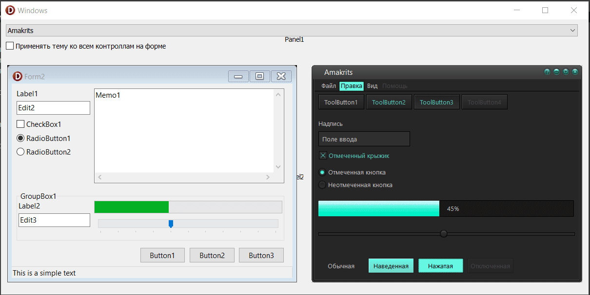

# delphi_themes

v.0.0.4
- кастомизирован TVclStylesPreview.Paint: добавлена отрисовка дополнительных контролов для наглядности
- фиксы в коде для правильной загрузки и отображения тем

v.0.0.3
- добавлен сторонний модуль Vcl.Styles.Ext (отсюда https://github.com/RRUZ/vcl-styles-utils)
- слямзил кастомную отрисовку превью-формы при изменении стилей
- добавлена папка со стилями из дельфей + папка с некоторыми превьюшками стилей в png

v.0.0.2
- редизайн формы: добавлена preview форма

